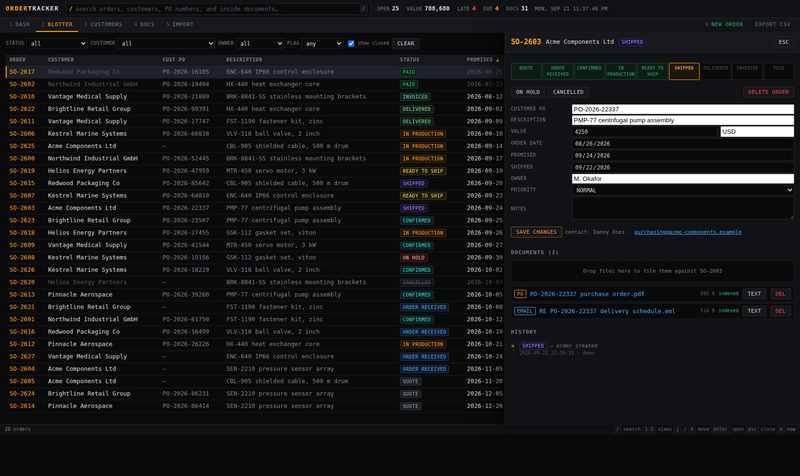

# Order Tracker

A local, Bloomberg-style terminal for a PCB sales desk: every order from every
customer on one dense screen, colour-coded by stage, with the full build
specification and cost sheet behind each one, and every piece of paperwork
filed against the order it belongs to and searchable by its contents.

It runs entirely on your own machine. No server, no cloud account, no
subscription, and nothing leaves the computer.



## What it does

**One order book.** Every order across every customer in a single sortable,
filterable blotter — order number, customer, their PO number, stage, promised
date, days until due, value, owner, document count.

**Shows you where your customers are, and what time it is there.** The
dashboard opens on a world map with every customer on it, sized by how much
work is open and turning red when something is flagged. The day/night line
sweeps across it in real time, with the sun and the moon at the point each is
overhead, and a row of clocks underneath tells you who is at their desk right
now and who is asleep.

**Holds the whole build specification.** Layers, material, panel, finish,
copper, drills, impedance, BVH — with the conversions done for you: ounces to
microns and millimetres, a thickness tolerance in percent to a range in
millimetres, and how many boards come off a working panel.

**Prices the job in won and quotes it in dollars.** Enter the PCB price, and
for a turnkey order the SMT, the stencils and the components. Inflation and
markup are applied on top, and the whole sheet totals as you type. One click
prints the specification and the costing on white paper.

**Tells you what needs chasing.** The dashboard raises flags without being
asked:

| Flag | Meaning |
| --- | --- |
| `OVERDUE` | past its promised date and not shipped |
| `DUE SOON` | promised within the next 7 days |
| `STALLED` | open, but nobody has touched it in 14 days |
| `NO PO` | confirmed or further along with no customer PO on file |
| `ON HOLD` | parked, so it stops counting as on-track |

**Keeps the paperwork with the order.** Drop in POs, invoices, packing lists,
signed contracts and saved emails. The text inside each file is read and
indexed, so searching `Meridian Freight` finds the packing list that mentions
the carrier, not just files named after it. A file that names an order number
is filed against that order automatically.

**Imports the exports you already have.** Point it at a `.csv` or `.xlsx` from
your ERP or order portal. Columns are matched up for you — `Sales Order #`,
`Customer PO`, `Requested Delivery` and friends are all recognised — and you
confirm the mapping before anything is written. Re-importing a fresh export
updates the orders already on file, matched on order number, which is how you
refresh statuses in bulk.

**Repeats an order without retyping it.** A repeat customer usually wants the
same board again. Pick the earlier order and the whole specification and cost
sheet come across; you give it a new number and change what has moved.

**Backs itself up somewhere else.** Point it at a second folder — another
drive, a network share — and it copies the order book there every time it
starts, keeping the last several copies. The status bar always shows when your
work was last saved and last backed up.

**Keyboard-first.** `/` to search, `1`–`6` for views, `j`/`k` to move down the
blotter, `enter` to open, `n` for a new order, `esc` to close.

## The build specification and cost sheet

Open any order and there are five tabs: **ORDER**, **SPEC**, **COST**,
**DOCS** and **HISTORY**.

**SPEC** holds what is being made:

| | |
| --- | --- |
| Quotation | quote date, quote reference, contact person |
| What it is | product type (rigid, flex, flex-rigid), class, CCL material |
| Size and panel | board size, array size, ups per array, working panel |
| Stack-up | layers, thickness and tolerance, copper inner and outer, surface finish and its thickness, impedance |
| Drilling | minimum drill size and how many, total drills, BVH and which layers |
| Order | options, quantity per lot, number of lots |

Underneath, the things that follow from it are worked out as you type: copper
weight in ounces, microns and millimetres; the thickness tolerance as a
millimetre range; how many arrays fit a working panel and how many boards that
is; how many panels the order needs and how much of each is used.

**COST** is entered in won and shown in both currencies:

- **PCB** — the total, or the price per piece. Fill in either and the other
  follows from the quantity.
- **Turnkey** — tick it and SMT, stencils and components appear. Two stencils
  are needed when both sides are populated; the price per stencil starts from
  the figure on the SETUP page.
- **Inflation** (× 1.25 by default) and **markup** (20–30%) can be applied to
  every total, and the exchange rate converts the result to dollars.

An order keeps the rates it was quoted at. Changing the exchange rate or the
markup on the SETUP page sets the starting point for new orders and never
reprices an old quote behind your back.

**PRINT SHEET** opens a clean page on white paper — the specification, the
costing and the documents on file — ready for `Ctrl+P` or saving as a PDF.

## Putting customers on the map

Open **CUSTOMERS**, edit one, and pick a country. That is enough: the position
and the time zone follow from it, and a city is used instead when it is one
the app knows (Shenzhen, San Jose, Stuttgart, Ansan and others). Type a
latitude and longitude yourself if you want it exact.

The clocks are shown in each customer's own zone and track daylight saving,
because they are worked out from the zone name rather than a fixed offset.

## Backups, and when it last saved

The status bar at the bottom always shows when your order book last changed
and when it was last copied somewhere else.

On the **SETUP** page, give it a backup folder — another drive, a USB stick, a
network share. From then on it takes a copy every time it starts, keeps the
last ten, and mirrors your documents alongside. **BACK UP NOW** does it on
demand.

The copy is taken through SQLite's own backup, not by copying the file, so it
always holds the changes you made seconds earlier. A backup is a complete,
working order book: point the app at that folder and it opens.

## Setting it up

Run this once. It asks where to keep your data, offers to move anything
already stored, and puts a shortcut on the desktop:

```bash
python3 setup.py               # Windows: py setup.py
```

Pick any folder on any drive — an external or network drive is fine. The
choice is remembered outside the app folder, so updating or re-downloading
the app never moves your orders. Run `setup.py` again any time to change it.

## Running it

You need Python 3.10 or newer. Nothing else — no `pip install`, no Node, no
database to set up.

Double-click the desktop shortcut, or:

```bash
python3 run.py
```

Starting it a second time just reopens the browser rather than running two
copies.

### Stopping it

Click **QUIT** in the top-right of the app. That is the whole answer — there
is no console window to keep open.

The desktop shortcut starts the app windowless, so nothing appears in the
taskbar. It keeps running in the background after you close the browser tab,
which is what you want when you are flicking between it and your email.
Closing the tab does not stop it; QUIT does. If you started it from a command
prompt instead, `Ctrl+C` there also works.

Your data is written as you go, so stopping it never loses anything.

## Running it from a personal or USB drive

The whole thing is portable — plain Python files, a database and your
documents, with nothing installed into Windows. One command moves it:

```
py move_to.py "G:\my folder\Order Tracker"
```

That copies the app and everything you have stored to the new folder,
switches the copy to portable mode, and repoints the desktop shortcut at it.
Nothing is deleted — the old folder stays until you check the copy works and
remove it yourself.

**Everything comes with it.** Your orders and documents, the settings from the
SETUP page (they live in the database), your name on the welcome screen, and
the git history, so `git pull` still updates the app from its new home.

**Close Order Tracker first.** It refuses to run while the app is open,
because copying a database that is being written to is the one way this can
leave you worse off than you started. Click QUIT, then run it.

To test a destination before committing to it — useful if a copy has already
gone wrong once:

```
py move_to.py "G:\my folder\Order Tracker" --check
```

That reports whether the folder can be written to and what would be copied,
and copies nothing. If the copy itself fails, it names the files it could not
write rather than printing a wall of Python. `--no-git` leaves out the git
history, which is most of the files and none of the app.

### Doing it by hand

If the drive refuses Python but File Explorer copies to it happily — which is
common on company and network drives — ask for the plan instead:

```
py move_to.py "G:\my folder\Order Tracker" --manual
```

That writes nothing. It prints exactly which folders to copy and where, with
the number of orders and documents in each so you can check the copy
afterwards. It names your data folder specifically, because it is usually
**not** inside the app folder and is the step people miss.

Once you have copied everything across, open a Command Prompt in the new
folder — click the address bar in File Explorer, type `cmd`, press Enter —
and run:

```
py move_to.py --finish
```

That marks the copy portable, carries your welcome name over, repoints the
desktop icon, and tells you how many orders it found. It never touches the
folder you copied from, so if anything is wrong the original is still there.

`py setup.py --portable` does the portable part on its own, if that is all
you need.

That writes a `portable.txt` marker beside `run.py`. While that file is
there, orders and documents stay inside the app folder, any saved location is
ignored, and the settings file moves into the folder too — so the folder works
whatever drive letter it gets on whatever machine, and your welcome name comes
with it. Move it, copy it, back it up — it is one folder.

Delete `portable.txt` to go back to a chosen data folder.

Two things to know:

- **Python must exist on whatever machine you plug into.** The app carries no
  interpreter. Any machine with Python 3.10+ runs it.
- **Re-run `py setup.py --shortcut` after moving**, so the desktop icon points
  at the new location.

It opens `http://127.0.0.1:8787/` in your browser. Press `Ctrl+C` to stop.

To look around before putting real data in, load the sample order book. It goes
into its own `demo-data/` folder and never touches your real one:

```bash
python3 run.py --demo
```

Other options:

```bash
python3 run.py --port 9000     # if 8787 is taken (it will find a free port anyway)
python3 run.py --no-browser    # don't open a browser
python3 run.py --reindex       # re-read the text of every stored document
python3 run.py --data FOLDER   # keep orders and documents somewhere else
python3 run.py --where         # print where the data is kept and what is in it
```

### If the desktop shortcut is missing

Make just the shortcut, leaving everything else alone:

```
py setup.py --shortcut
```

On Windows the Desktop folder is found through the registry, so a desktop
that OneDrive has taken over is handled. If PowerShell is blocked by policy,
a `.bat` launcher is written instead — it starts the app the same way.

### If it won't start

Run the check. It walks the same steps the app does and names whatever
fails:

```bash
python3 doctor.py              # Windows: py doctor.py
```

The usual culprit on Windows is something guarding the folder rather than
anything in the app — ransomware protection (Windows Security → Virus &
threat protection → Controlled folder access), OneDrive keeping the folder
online-only, or antivirus blocking new database files. Keeping the data
outside the protected area gets past all three:

```
py run.py --demo --data "%LOCALAPPDATA%\OrderTracker"
```

**On Windows** use `py run.py`. If Python isn't installed, get it from
python.org and tick "Add Python to PATH" during setup.

**On macOS** Python 3 is already there. Open Terminal, `cd` to this folder and
run the command above.

## Where your data lives

Wherever you pointed `setup.py`, in one folder:

```
<your folder>/
  data/
    orders.db        all orders, customers, history and extracted text
    documents/       the original files, exactly as you dropped them in
  demo-data/         the sample order book, kept well away from the real one
```

If you never ran `setup.py`, it sits beside the app instead. `python3 run.py
--where` always tells you.

Back it up by copying that folder. Move it to another machine by copying it
there.

Everything you change on the SETUP page is kept in `orders.db`, so it travels
with your data. The only thing kept elsewhere is a small settings file
recording your chosen folder and welcome name:

| | |
| --- | --- |
| Windows | `%LOCALAPPDATA%\OrderTracker\settings.json` |
| macOS | `~/Library/Application Support/OrderTracker/settings.json` |
| Linux | `~/.config/order-tracker/settings.json` |
| **Portable** | `settings.json` beside `run.py`, so nothing is left behind |

Data folders are excluded from git, so customer information is never
committed.

## The welcome screen

`setup.py` asks for a name to greet you with at startup. To change it later,
run `setup.py` again, or edit `welcome_name` in the settings file above.
Setting `show_welcome` to `false` there turns the splash off entirely.

## Making it yours

Most of it is on the **SETUP** page (`6`), no code involved:

- **Money** — exchange rate, the inflation multiplier, the default markup, the
  stencil price and its expected range.
- **Alerts** — how many days ahead counts as due soon, how long untouched
  counts as stalled, the unusable margin around a working panel.
- **Lists on the order form** — working panels (`CODE | width | height`),
  surface finishes, CCL materials, product types and classes. One per line;
  add your own and they appear in the drop-downs straight away.
- **Welcome screen** — the name you are greeted with, and whether it shows.
- **Backups** — the folder, how many copies to keep.

These are stored with your data, so they travel with it to another drive.

For the rest, open `ordertracker/config.py`. It is meant to be edited:

- **`PIPELINE`** — the stages an order moves through. Rename them to whatever
  your business says. The blotter, the board and the stage buttons all follow.
- **`DATE_INPUT_ORDER`** — `"MDY"` reads `03/12/2026` as 3 March;
  `"DMY"` reads it as 12 March. Unambiguous dates (`2026-12-03`, `3-Dec-2026`)
  always work either way.
- **`PO_REQUIRED_FROM`** — the stage at which a missing customer PO becomes a
  problem.
- **`DOC_KINDS`** — the keywords that classify a dropped file.

## What it does not do

Worth knowing before you rely on it:

- **Scanned paper isn't searchable inside.** A PDF that is a photograph of a
  document has no text to read. It is still stored and still findable by
  filename, customer and order — but finding words inside it would need OCR,
  which is not included. PDFs generated by software (which is nearly all
  purchase orders and invoices) read perfectly.
- **It is single-user and has no password.** It listens on `127.0.0.1`, so only
  your machine can reach it; requests arriving under another hostname are
  refused, and writes triggered from another website are rejected. Sharing it
  across a team means adding accounts and access control, which this does not
  have. Don't expose the port to a network.
- **The map is a backdrop, not an atlas.** The coastlines are drawn by hand and
  deliberately rough. Customer pins are plotted from real coordinates, so they
  land in the right place regardless.
- **It doesn't talk to your ERP.** Data arrives by import, by drag-and-drop, or
  by typing. A live connection would be the next thing to build.
- **Legacy `.doc` and `.xls`** (the old binary formats) can't be read for text.
  Save as `.docx` / `.xlsx` if you need their contents searchable.

## Developing

```bash
python3 -m unittest discover tests     # 142 tests, no dependencies
```

The pieces:

```
run.py                      entry point
setup.py                    first-run wizard: storage folder, shortcut, name
move_to.py                  copy the app and its data to another drive
doctor.py                   startup check when something will not run
ordertracker/
  config.py                 pipeline, thresholds, paths — edit this first
  settings.py               remembered storage folder and welcome name
  shortcut.py               desktop shortcut for Windows, macOS and Linux
  prefs.py                  the settings page's values, stored with the data
  db.py                     SQLite schema and full-text indexes
  orders.py                 order logic, alerts, search, dashboard
  pcb.py                    build specification, conversions and costing
  printsheet.py             the printable specification and cost sheet
  geo.py                    countries, positions and time zones
  backup.py                 the second copy, and when things last saved
  documents.py              file storage, classification, auto-filing
  importer.py               CSV / Excel import and column matching
  xlsx.py                   a small read-only .xlsx reader
  multipart.py              file-upload parsing
  server.py                 HTTP server and JSON API
  sampledata.py             the --demo order book
  extract/                  text out of PDFs, emails, Office files, HTML
web/                        the single-page front end (no build step)
  world.js                  hand-drawn coastlines, so no map data is fetched
  map.js                    the map, the day/night line, sun and moon
  spec.js                   the specification form and the cost sheet
  setup.js                  the settings page
assets/                     app icon (regenerate with tools/make_icon.py)
tests/                      the test suite
```

Everything uses the Python standard library only. That is deliberate: it means
this still runs in five years on a machine with nothing installed on it.
